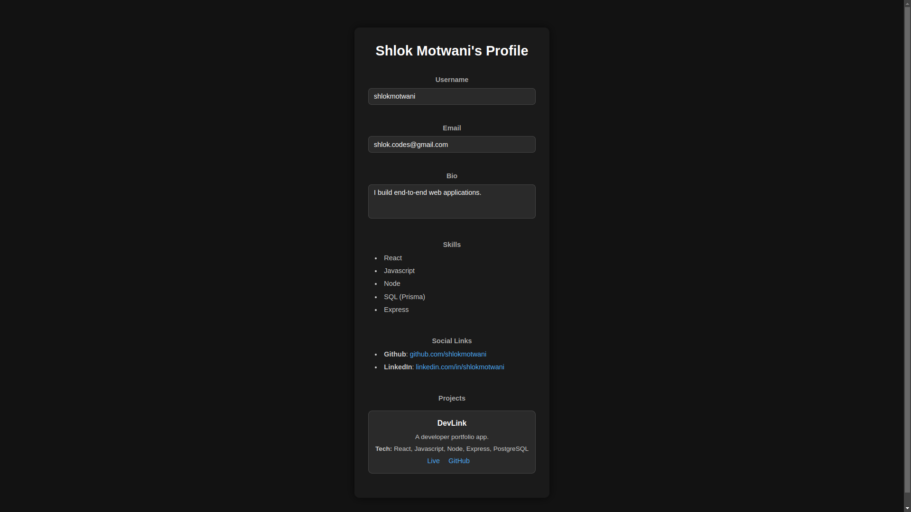
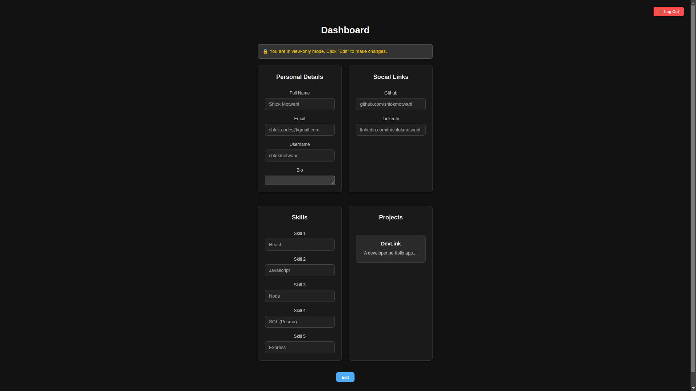
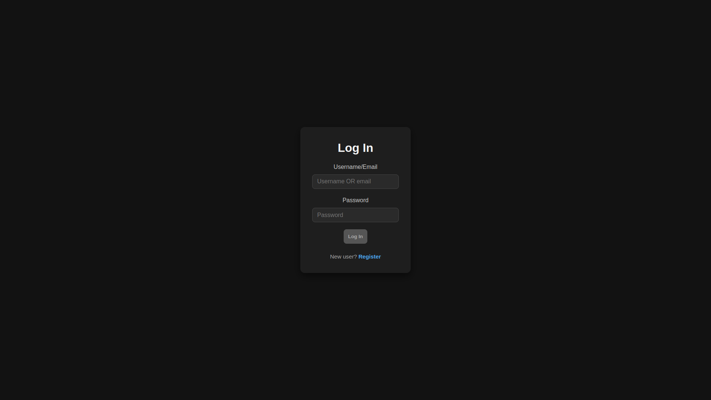
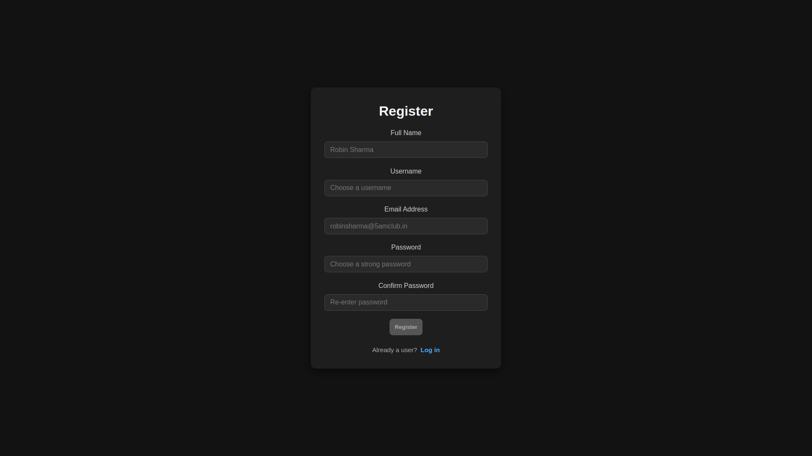
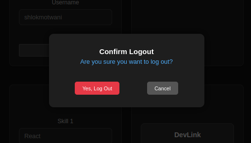

# 🚀 DevLink – Developer Portfolio Hub (MERN + Prisma)

DevLink is a full-stack web application where developers can create and share beautiful portfolio profiles. It lets users showcase projects, skills, social links, and resumes—all under a unique public URL.

Built using **MERN stack** with **Prisma + PostgreSQL** for robust relational data modeling.

---

## 📸 Demo (Coming Soon...)

**Live URL:** [https://dev-link-app.netlify.app/](https://dev-link-app.netlify.app/)

---

## 📸 Screenshots

### 🧑‍💻 User Profile



### 📊 Dashboard



### 🔐 Login Page



### 📝 Registration Page



### 🚪 Logout Modal



## 📚 Features

- 🔐 Authentication (JWT)
- 🧑‍💻 Public Portfolio Page (`/username`)
- 🛠️ Project Management (CRUD)
- 🧩 Skills & Tech Stack
- 🌐 Social Links (GitHub, LinkedIn, etc.)

---

## 📚 Upcoming Features

- 💼 Resume Upload (PDF)
- 🎨 Theme Toggle (Light/Dark)
- ☁️ Cloudinary Image Upload
- 📈 View Analytics & QR Code Generator

---

## 🧱 Tech Stack

### Frontend

- React + Vite
- Vanilla CSS
- React Router DOM

### Backend

- Node.js + Express
- PostgreSQL + Prisma ORM
- JWT for auth
- Cloudinary (media storage)
- Multer (file uploads)
- dotenv

---

## 📁 Folder Structure

```bash
devlink/
├── client/          # React frontend
└── server/          # Express + Prisma backend
```

## 🙌 Contributing

Pull requests are welcome! For major changes, please open an issue first.

## 📄 License

MIT

## ✨ Author

☕ Shlok Motwani
